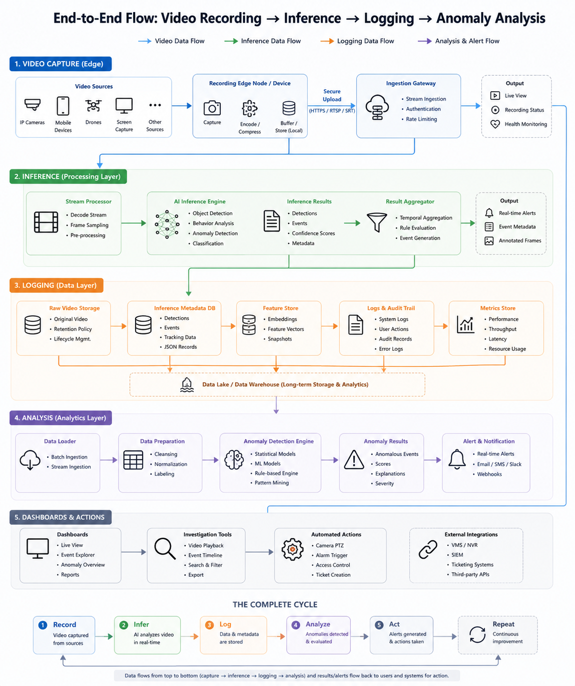

# CYPHER | Intelligent CCTV Surveillance System

CYPHER is an AI-driven, real-time industrial surveillance intelligence and log monitoring system. It leverages the Gemini API to analyze regions of interest (bounding boxes) in a live video stream, count humans/machines, generate descriptive summaries, and push parsed telemetry records directly to a Supabase database. These records are then beautifully rendered on the CYPHER web dashboard.

---

## System Architecture

Below is the conceptual and technical flow of the CYPHER surveillance system:



---

## File System Structure

```
CCTV/
├── main.py             # Core application launcher. Handles camera stream, canvas drawing, and Gemini model inference.
├── database.py         # Handles connection to PostgreSQL database, retrieves user profiles, and pushes formatted logs.
├── logger.py           # Application-specific logging configuration for writing logs to app.log and system.log.
├── requirements.txt    # Declares all Python dependencies required by the system.
├── app.log             # Telemetry log storing the JSON-formatted summaries pushed to the database.
├── system.log          # System status log tracking activations, deactivations, and execution errors.
├── tableName.txt       # Local cache storing the user's log table UUID.
├── line.txt            # Local counter tracking the last processed line in app.log to avoid duplicate database inserts.
├── flowchart.png       # Architecture diagram illustrating system components and data flow.
├── imageAssets/        # Folder containing temporary image crops of drawn bounding boxes for inference.
└── frontend/           # Cypher Web Dashboard client.
    ├── index.html      # Public landing page.
    ├── auth.html       # Sign-in and Sign-up portal for dashboard access.
    ├── dashboard.html  # Logs monitoring dashboard.
    ├── app.js          # Handles auth state and retrieves logs using the user's unique log_table identifier.
    └── styles.css      # Core styles and design system token definition.
```

---

## How It Works

1. **Dashboard Registration:** Users sign up on the CYPHER Web Dashboard to establish their profile. During signup, a unique user identifier (`log_table` UUID) is generated and stored.
2. **Camera Initialization:** The user runs `main.py` locally and inputs their credentials. The script queries the database to retrieve their unique `log_table` UUID.
3. **Region Selection:** The user defines target monitoring zones by clicking on the live video feed window.
4. **AI Inference:** When activated, the system crops the selected regions of interest, feeds them to Gemini, and obtains structured JSON objects containing count analytics and descriptions.
5. **Database Sync:** The local database pipeline parses `app.log` and pushes these records containing the unique ID to the shared `logs` table in Supabase.
6. **Web Dashboard rendering:** The frontend dashboard queries the `users` table to fetch the unique log ID, caches it in `localStorage` under `sb_log_table`, and queries the unified `logs` table directly using this ID.

---

## Getting Started Guide

Follow these steps to configure and run the CYPHER surveillance system locally:

### Step 1: Sign Up on the CYPHER Dashboard
Before running the local Python system, you must create a profile:
1. Go to the **CYPHER Dashboard Link** *(link to be inserted)*.
2. Click **Login / Register** and navigate to the **Sign Up** tab.
3. Register your profile to generate your unique log table identifier.
4. Keep your registered email and password handy, as you will need to input them when starting the local Python application.

### Step 2: Install Python Dependencies
Open your terminal in the project directory and run the following command to download all required packages:
```bash
pip install -r requirements.txt
```

### Step 3: Configure Environment Variables
Create a `.env` file in the root directory and define the following variables with your Supabase database URL and Gemini API credentials:
```env
DATABASE_URL=your_postgresql_database_connection_string
GEMINI_API_KEY=your_gemini_api_key
```

### Step 4: Run the Surveillance System
Execute the following command to launch the system:
```bash
python main.py
```
You will be prompted to enter:
- **Registered Email-ID** (your dashboard email)
- **Password**
- **Camera Index** (`0` for your primary webcam, `1` or higher for secondary cameras)

---

## Keyboard Controls & Interactions

Interact with the live camera window ("Video Feed") using the following hotkeys:

| Key | Action | Description |
| :---: | :--- | :--- |
| **`I`** | **Toggle Inference** | Starts or stops calling the Gemini API to analyze the camera feed. Shows a green indicator (activated) or red indicator (deactivated) on the feed window. |
| **`U`** | **Undo last point/click** | Removes the last clicked corner point or the last completed bounding box from the canvas. |
| **`C`** | **Clear all boxes** | Instantly deletes all bounding boxes and canvas drawings from the window. |
| **`Q`** | **Quit application** | Safely stops database threads, releases the camera stream, and closes all open windows. |

---

## Web Dashboard Telemetry

The web application retrieves and displays logs using a lightweight structure:
- Reads the logged-in user profile to fetch their `log_table` UUID.
- Caches the UUID locally (`sb_log_table`).
- Performs a filtered request to the `logs` table: `rest/v1/logs?unique_id=eq.<UUID>`.
- Displays real-time counts, timestamped logs, and structured machine data details in the collapsible dashboard grid.
